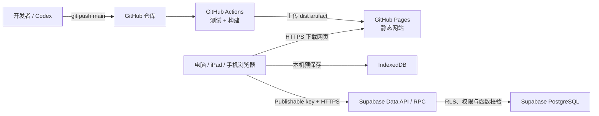

# GitHub Pages + Supabase 标准部署手册

> 适用于本仓库，也可作为 Vite/React 静态网站接入 Supabase 的通用模板。更新日期：2026-09-08。

## 1. 最终会得到什么

完成后，系统由两个相互独立但通过 HTTPS 协作的部分组成：

- **GitHub** 保存源代码；GitHub Actions 在每次推送 `main` 后自动测试、构建并发布到 GitHub Pages。
- **GitHub Pages** 只托管 HTML、CSS、JavaScript、图片等静态文件，不运行 Node 服务，也不保存客户数据。
- **Supabase** 提供 PostgreSQL 数据库、Data API 和数据库函数，负责云端保存、多设备同步、权限验证与数据隔离。
- **浏览器 IndexedDB** 负责本机预保存。网络暂时中断时数据仍先留在本机，恢复后再同步。



关键结论：**GitHub 负责发布网页，Supabase 负责保存业务数据。仅把代码上传到 GitHub，不会自动获得数据库或多设备同步。**

## 2. 这套项目当前的数据机制

### 2.1 顾问模式

1. 前端先用 `VITE_ALLOWED_USERNAMES` 判断用户名是否出现在入口名单。
2. `workspace_login` 校验密码并签发 8 小时随机会话。后续 RPC 通过 `workspace_username_allowed` 验证会话；浏览器不保存顾问密码。
3. 数据库中的 `workspace_users.access_hash` 保存 bcrypt 风格密码哈希，不保存明文密码。
4. 顾问档案保存在 `workspace_customer_records`，以 `username + customer UUID` 隔离。
5. `sync_write_v2` 校验客户端持有的服务端 revision；版本冲突保留本机与云端两份，等待用户选择，不按设备时钟覆盖。

前端白名单只是界面层限制，不能代替数据库校验。新增顾问账号时，GitHub Variable 和 Supabase `workspace_users` 必须同时更新。

### 2.2 家庭财务自测模式

1. 顾问生成随机邀请码；客户兑换后获得该档案 UUID 与访问令牌。默认最多兑换 3 次；第三次签发的令牌仍有效，撤销后云端拒绝读写。
2. 令牌只保存在客户当前浏览器的 `localStorage`；Supabase 只保存 SHA-256 哈希。
3. 联系人姓名未填写、资料完成度未达到同步阈值时，不上传云端。
4. 达到条件后，资料与待同步意图同时写入分区 IndexedDB，再防抖调用 `sync_write_v2`。失败保留队列，恢复网络后重试；冲突不自动重试覆盖。
5. 客户只能凭本设备令牌读取自己的记录；顾问通过已验证的管理员凭据查看自填档案。

这个模式不是传统账号系统。换设备需要再次兑换仍可使用的邀请码，不能凭姓名读取档案；如需完整客户账号体系，应另行评估 Supabase Auth。

### 2.3 当前主要数据库对象

| 对象 | 用途 | 浏览器是否可直接操作表 |
|---|---|---|
| `workspace_users` | 顾问白名单、状态和密码哈希 | 否 |
| `workspace_customer_records` | 顾问录入档案 | 否，只能经受控 RPC |
| `public_intake_records` | 客户自填档案与令牌哈希 | 否，只能经受控 RPC |
| `customer_records` / `analysis_snapshots` | 早期 Supabase Auth 架构基础表 | 仅 `authenticated` 且受 RLS 控制 |

## 3. 安全模型：哪些值能公开

### 可以进入前端构建

- `VITE_SUPABASE_URL`
- `VITE_SUPABASE_PUBLISHABLE_KEY`，格式通常为 `sb_publishable_...`
- `VITE_ALLOWED_USERNAMES`（它不是安全凭据）

Supabase 官方说明 Publishable key 可用于网页、移动端和桌面端。它会被任何访问网站的人从浏览器网络请求或 JavaScript 中看到，因此安全性必须来自数据库权限、RLS 与 RPC 校验。

### 绝不能进入前端或 Git

- Supabase Secret key：`sb_secret_...`
- Legacy `service_role` key
- 数据库连接密码 / Connection string
- 顾问明文访问密码
- GitHub Personal Access Token
- Supabase Personal Access Token

Secret key 与 `service_role` 会绕过 RLS，只能放在受控服务器、Edge Function 或 CI Secret 中；这个纯前端项目不需要它们。

本项目的数据通过 HTTPS 传输，但业务 JSON 在 PostgreSQL 中不是应用层端到端加密。不要仅凭“使用 Supabase”就宣称满足特定金融、医疗或隐私合规要求；正式处理高度敏感资料前应完成独立安全与合规评估。

## 4. 准备工作

需要：

- GitHub 账号；公开仓库可使用 GitHub Free 的 Pages。
- Supabase 账号和一个项目。
- Git。
- Node.js 20 或以上；当前 Actions 使用 Node 22。
- pnpm 10。

本地检查：

```bash
node --version
pnpm --version
git --version
```

## 5. 为朋友复制项目的推荐方式

### 方式 A：Fork（推荐）

1. 在 GitHub 打开本仓库。
2. 点击 **Fork**，创建到朋友自己的账号。
3. Clone 朋友自己的仓库：

```bash
git clone https://github.com/FRIEND_ACCOUNT/family-asset-analyzer.git
cd family-asset-analyzer
pnpm install --frozen-lockfile
```

Fork 不会复制原仓库的 Actions Secrets，这是正确且安全的行为。朋友必须绑定自己的 Supabase 项目。

### 方式 B：从模板建立全新仓库

如果未来把仓库设置为 Template，可选择 **Use this template**。新仓库没有原仓库的提交历史，更适合独立产品。

禁止让两位互不相关的使用者共用同一个生产 Supabase 项目，否则数据、配额、删除权限和故障范围都会混在一起。

## 6. 创建 Supabase 项目

1. 登录 Supabase Dashboard，点击 **New project**。
2. 选择组织、项目名称与离主要用户最近的 Region。
3. 生成并妥善保存强数据库密码；本项目网页不会使用这个密码。
4. 保持 Data API 可用。
5. 建议为新表自动启用 RLS；即使开启，migration 仍应显式执行 `enable row level security`。
6. 等待项目状态变为 Healthy。

找到连接信息：

- Project URL：项目首页的 Connect 区域，或 **Settings → API** / **Integrations → Data API**。
- Publishable key：**Settings → API Keys → Publishable key**。

不要复制 Secret key。

## 7. 初始化数据库

### 7.1 首次安装：Supabase SQL Editor

首次部署且尚未使用 CLI 管理迁移时：

1. 打开 Supabase **SQL Editor → New query**。
2. 按文件名时间顺序，逐份执行 `supabase/migrations/` 下的全部 SQL。不要只执行早期的四份文件。可先列出当前完整清单：

```text
ls supabase/migrations/*.sql
```

3. 每份脚本成功后再执行下一份。
4. 不要倒序或只执行最后一份；后面的函数依赖前面的表、扩展和函数。成熟项目只应用确认尚未执行的增量，不盲目重跑旧函数定义。

### 7.2 创建顾问账号与密码哈希

在 SQL Editor 单独执行下面的命令，把示例值换成自己的值：

```sql
insert into public.workspace_users (username, active, access_hash)
values (
  lower(trim('YOUR_USERNAME')),
  true,
  crypt('YOUR_STRONG_ACCESS_PASSWORD', gen_salt('bf', 12))
)
on conflict (username) do update
set active = excluded.active,
    access_hash = excluded.access_hash;
```

注意：

- 这条语句只在 Supabase 安全界面中执行，不保存到仓库，不截图公开。
- 登录支持字符密码。使用独立强密码；当前 bcrypt 登录接口限制为不超过 72 字节。
- `VITE_ALLOWED_USERNAMES` 需要包含相同的小写用户名。

验证时不要读取哈希全文，可运行：

```sql
select username, active, access_hash is not null as password_configured
from public.workspace_users;
```

### 7.3 成熟团队：Supabase CLI migration

当项目开始由多人维护后，官方建议所有数据库变更都通过 `supabase/migrations/`，而不是继续在远端 Table Editor 临时修改：

```bash
supabase login
supabase link --project-ref YOUR_PROJECT_REF
supabase migration list
supabase db push
```

新变更：

```bash
supabase migration new describe_your_change
# 编辑新生成的 SQL
supabase db reset
pnpm run test
supabase db push
```

规则：

- 一次只允许一个人向生产库执行 `db push`。
- 数据库 migration 与前端 Pages 发布应分开；不要让每次改 CSS 都自动获得生产数据库写权限。
- 如果当前远端曾手动执行 SQL，应先用 `supabase migration list` 核对历史，再决定是否 repair；不要盲目运行修复命令。

## 8. 本地连接与验证

复制环境变量模板：

```bash
cp .env.example .env.local
```

编辑 `.env.local`：

```dotenv
VITE_SUPABASE_URL=https://YOUR_PROJECT_REF.supabase.co
VITE_SUPABASE_PUBLISHABLE_KEY=sb_publishable_xxxxxxxxx
VITE_ALLOWED_USERNAMES=your_username
```

`.env.local` 已在 `.gitignore` 中，不会上传。仍需检查：

```bash
git status --short
git check-ignore .env.local
```

启动与生产验证：

```bash
pnpm install --frozen-lockfile
pnpm run dev
pnpm run test
pnpm run build
pnpm run preview
```

本地至少验证：

1. 名单外用户名被拒绝。
2. 正确顾问用户名与密码可进入。
3. 新建一个测试客户，修改后本机显示已保存。
4. 点击保存/同步后刷新仍存在。
5. 客户自测未填姓名时不上传；达到同步条件后显示云端同步状态。

## 9. 创建或连接 GitHub 仓库

新项目示例：

```bash
git init
git add .
git commit -m "Initial application"
git branch -M main
git remote add origin https://github.com/OWNER/REPOSITORY.git
git push -u origin main
```

如果已经 Fork/Clone，不要再次 `git init`；用下面的命令确认远端：

```bash
git remote -v
git branch --show-current
```

推送前必须确认 `.env.local` 不在暂存区：

```bash
git status --short
git diff --cached
```

## 10. 配置 GitHub Actions Secrets 与 Variable

进入朋友自己的仓库：

**Settings → Secrets and variables → Actions**

在 **Secrets** 新建：

| 名称 | 值 |
|---|---|
| `VITE_SUPABASE_URL` | 朋友自己的 Supabase Project URL |
| `VITE_SUPABASE_PUBLISHABLE_KEY` | 朋友自己的 Publishable key |

在 **Variables** 新建：

| 名称 | 示例 |
|---|---|
| `VITE_ALLOWED_USERNAMES` | `jojo` 或 `alice,bob` |

为什么 Publishable key 仍放在 GitHub Secret：它不是服务器机密，但用 Secret 可以避免在 workflow 源码和普通日志中直接写死。请记住，它编译后仍对浏览器公开。

## 11. 开启 GitHub Pages

进入：

**Settings → Pages → Build and deployment → Source → GitHub Actions**

当前工作流位于 `.github/workflows/deploy-pages.yml`，机制如下：

1. 监听 `main` push，或手动 `workflow_dispatch`。
2. Checkout 代码。
3. 安装 pnpm 与 Node。
4. `pnpm install --frozen-lockfile`。
5. 运行测试。
6. 注入三个 `VITE_` 构建变量并执行 Vite build。
7. 把 `dist/` 上传为 Pages artifact。
8. 使用 `actions/deploy-pages` 发布。

工作流需要：

```yaml
permissions:
  contents: read
  pages: write
  id-token: write
```

`vite.config.ts` 当前使用 `base: './'`，因此仓库站点位于 `https://OWNER.github.io/REPOSITORY/` 时，静态资源仍能正确使用相对路径。

## 12. 第一次自动部署

配置完成后，推送一次 `main`：

```bash
pnpm run test
pnpm run build
git add .
git commit -m "Configure deployment"
git push origin main
```

到 **Actions → Deploy GitHub Pages** 查看：

- 绿色：部署完成。
- 红色：打开失败的 step，先修复测试、构建、Secret 名称或 Pages 权限。

默认网址：

```text
https://OWNER.github.io/REPOSITORY/
```

之后每次推送 `main` 都会自动重复测试、构建和部署；不需要手工上传 `dist/`。

## 13. 上线后的完整验收

### 发布验收

- Actions 最新 run 成功。
- Pages 地址返回 200，JS/CSS 无 404。
- 浏览器控制台没有 Supabase URL/key 缺失错误。
- 强制刷新后仍可打开。

### 云端验收

- 顾问模式登录成功。
- 顾问新增测试档案并同步。
- 第二台设备或无痕窗口用相同顾问凭据登录，可读到测试档案。
- 客户自测填写超过同步阈值后，顾问端能在“客户自填”分类找到。
- 两设备同时修改同一档案时，旧 revision 写入返回冲突，用户明确选择后才能继续，不丢弃另一份内容。
- 删除必须经过红色按钮与二次确认，并验证云端记录一并删除。

### 权限验收

在 Supabase 检查：

- 暴露于 `public` schema 的表已启用 RLS。
- `workspace_users`、`workspace_customer_records`、`public_intake_records` 未直接授权给 `anon`。
- `anon` 只能执行明确 grant 的 RPC。
- Security Advisor 没有未处理的高风险警告。

## 14. 日常更新的标准发布流程

```bash
git pull --ff-only
# 修改代码
pnpm run test
pnpm run build
git status --short
git diff --check
git add PATHS_YOU_CHANGED
git diff --cached
git commit -m "feat: describe the change"
git push origin main
```

随后检查 GitHub Actions 和线上版本。不要使用 `git add .` 无差别提交不相关文件，尤其不要提交本地客户导出、截图、`.env.local` 或调试日志。

数据库更新必须新增 migration，例如：

```text
supabase/migrations/202608140001_add_example_field.sql
```

遵守 `DATA_SAFETY.md`：增量增加字段、兼容旧 document、禁止因升级清空或批量覆盖已有客户数据。

## 15. 常见问题排查

### 页面能开，但显示未连接云端

依次检查：

1. GitHub Secret 名称是否完全为 `VITE_SUPABASE_URL` 和 `VITE_SUPABASE_PUBLISHABLE_KEY`。
2. Secret 是否配置在当前仓库，而不是原仓库或另一个 Environment。
3. 修改 Secret 后是否重新运行 workflow；旧构建不会自动改变。
4. Project URL 是否为 `https://PROJECT_REF.supabase.co`，不要填写 `/rest/v1/`。
5. 是否误用了 Secret key；前端必须使用 Publishable key。

### 登录提示用户名或密码错误

1. `VITE_ALLOWED_USERNAMES` 是否包含该用户名。
2. `workspace_users` 是否有小写用户名、`active = true`、`access_hash is not null`。
3. 是否已执行 `202608120003_access_password.sql`。
4. 密码更新后是否使用正确新密码。

### 本机有数据，另一台设备没有

1. 确认点击了同步或自测数据已达到自动上传阈值。
2. 检查页面同步状态与浏览器 Network 中 RPC 响应。
3. 两台设备是否使用同一个顾问工作区；客户自测随机令牌不会自动跨设备迁移。
4. 检查服务端 revision、待同步队列和冲突提示，不以两台设备时间先后决定覆盖。

### GitHub Actions 构建成功但页面空白

1. 检查 `vite.config.ts` 的 `base`。
2. 检查 `dist/index.html` 引用的资源路径。
3. 查看浏览器 Console 与 Network 是否有 404。
4. 如果使用前端 history 路由，需要为 GitHub Pages增加 SPA fallback；当前项目主要用内存视图，不依赖服务端路由回退。

### 数据库报函数不存在

说明 migration 未按顺序全部执行。核对当前全部 SQL 清单，不要只重新运行最后一份。

### Secret 疑似泄露

1. 如果是 Secret key、`service_role`、数据库密码或 PAT：立即在对应平台轮换/撤销。
2. 从当前文件删除并重新部署不等于从 Git 历史删除；必要时清理历史并通知所有使用者重新 clone。
3. 如果只是 Publishable key 被看到，这本身符合其设计；仍应立即检查 RLS、grant、RPC 与 Security Advisor。

## 16. 让 Codex 接手部署

朋友 Fork 后，在 Codex 中打开仓库，使用下面的指令：

```text
请先完整阅读 AGENTS.md、docs/GITHUB_SUPABASE_DEPLOYMENT.md、
DATA_SAFETY.md、supabase/migrations/ 和 .github/workflows/deploy-pages.yml。

目标：把这个仓库部署到我自己的 GitHub Pages，并连接我自己的 Supabase。
先只做只读检查并给出当前状态；不要覆盖已有数据，不要把任何 Secret key、
service_role、数据库密码或明文管理员密码写入代码、聊天、日志或 Git。
需要我在 GitHub/Supabase 界面提供或确认的信息时，逐项告诉我点击位置。
每完成一个阶段就运行验证，最后检查 Actions、线上地址、顾问同步和客户自测同步。
```

Codex 应自动完成的内容：

- 检查项目结构、workflow、migration、`.gitignore` 和环境变量引用。
- 创建 `.env.local` 模板或指导用户安全填写。
- 运行测试与构建并修复代码问题。
- 在获得授权后提交、推送、检查 Actions 与线上资源。
- 用只读查询验证数据库对象、RLS 与部署结果。

必须由用户确认或通过安全界面授权的内容：

- 使用哪个 GitHub 账号、仓库与 Supabase 项目。
- 创建项目和产生费用的选项。
- GitHub Secrets、数据库密码或高权限令牌的录入。
- 对生产数据库执行 migration。
- 删除、覆盖、重建或迁移现有数据。

## 17. 官方参考

- [GitHub Pages 自定义 Actions 工作流](https://docs.github.com/en/pages/getting-started-with-github-pages/using-custom-workflows-with-github-pages)
- [GitHub Actions Secrets](https://docs.github.com/en/actions/security-for-github-actions/security-guides/using-secrets-in-github-actions)
- [Supabase API keys](https://supabase.com/docs/guides/getting-started/api-keys)
- [Supabase Row Level Security](https://supabase.com/docs/guides/database/postgres/row-level-security)
- [Supabase Database Migrations](https://supabase.com/docs/guides/deployment/database-migrations)
- [Supabase Data REST API](https://supabase.com/docs/guides/api)

## 18. 一页验收清单

- [ ] 朋友使用自己的 GitHub 仓库和自己的 Supabase 项目。
- [ ] 当前全部 migration 按顺序成功应用。
- [ ] 顾问用户名存在、启用且已设置密码哈希。
- [ ] `.env.local` 未被 Git 跟踪。
- [ ] GitHub 两个 Secrets 与一个 Variable 已配置。
- [ ] Pages Source 为 GitHub Actions。
- [ ] `pnpm run test` 与 `pnpm run build` 通过。
- [ ] Actions 部署成功，线上 JS/CSS 无 404。
- [ ] 顾问模式第二设备同步成功。
- [ ] 客户自测上传后能在顾问端分类查看。
- [ ] 表已启用 RLS，基础表未直接暴露给 `anon`。
- [ ] 未在代码、构建日志和 Git 历史中出现任何高权限密钥。
